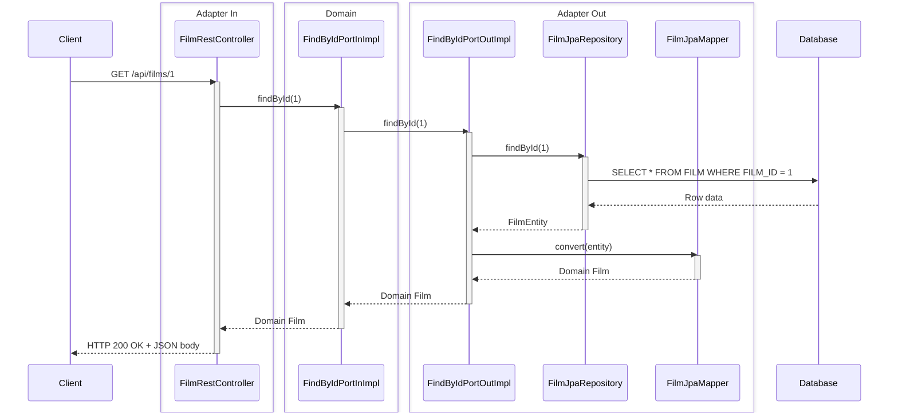
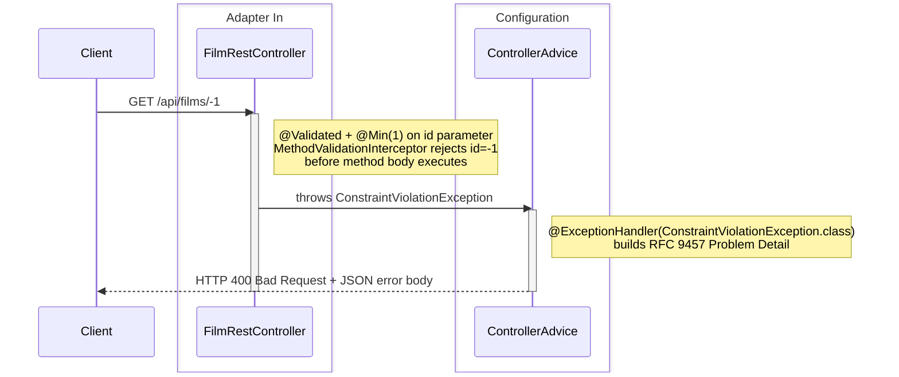

# Spring Boot Demo Projects Monorepo

This repository implements some use cases from the [Sakila Sample Database](https://dev.mysql.com/doc/sakila/en/) in Java/Kotlin/Groovy Spring Boot. It serves as a demo project for [Pollito's Opinion on Spring Boot Development](https://springboot.pollito.tech/), a Spring Boot guide.

## Essential Commands

### Build Commands

- `./gradlew build` - Full build: formats code, compiles, tests, runs coverage & mutation testing
- `./gradlew :spring_java:build` - Build only Java module
- `./gradlew :spring_groovy:build` - Build only Groovy module
- `./gradlew :spring_kotlin:build` - Build only Kotlin module

### Run Tests

- `./gradlew test` - Run all tests across all modules
- `./gradlew :{module}:test` - Run tests for specific module
- `./gradlew :spring_java:test --tests dev.pollito.spring_java.sakila.film.adapter.in.rest.FilmRestControllerTest` - Run single test (Java example)

### Code Formatting

- `./gradlew spotlessCheck` - Check code formatting
- `./gradlew spotlessApply` - Apply code formatting (Formatting is applied automatically during `./gradlew build`)

## Local Development

For the best local development experience, I recommend running the projects with their respective `bootRun` commands and using the `dev` profile to avoid OTLP connection noise:

```bash
# Run with dev profile
./gradlew :spring_java:bootRun -Dspring.profiles.active=dev
./gradlew :spring_kotlin:bootRun -Dspring.profiles.active=dev  
./gradlew :spring_groovy:bootRun -Dspring.profiles.active=dev
```

This approach provides several benefits:

- **Clean console output**: Avoids OTLP connection errors that spam your logs
- **Faster startup**: No attempts to connect to non-existent OTLP collector
- **Debug-friendly**: Easy to set breakpoints and debug in your IDE

## Stack

### Primary Languages

- Java 21 - Used in `spring_java` module
- Kotlin 2.2.21 - Used in `spring_kotlin` module
- Groovy 5.x - Used in `spring_groovy` module

### Runtime

- **Environment:** Java 21 (via Gradle toolchain)
- **Build Tool:**
  - Gradle 9.2.1
  - Wrapper: `gradle/wrapper/gradle-wrapper.properties`
- **Package Manager:** Maven Central (repositories)

### Frameworks

- **Core:** Spring Boot 4.0.x - All modules
- **Code Generation:**
  - OpenAPI Generator 7.x.x - API code generation
  - Hibernate Tools 7.0.2.Final - Entity reverse engineering from SQL schema
- **Code Quality:** Spotless - Code formatting
  - Google Java Format (Java)
  - Ktfmt (Kotlin)
  - GREclipse (Groovy)
- **Code coverage**: JaCoCo 0.8.14 - (80% line coverage required)

### Key Dependencies

- **Mapping:**
  - MapStruct 1.6.3 + MapStruct Spring Extensions 2.0.0 - Java/Kotlin DTO mapping
  - ModelMapper 3.2.6 - Groovy DTO mapping
- **Database:**
  - Spring Boot Starter Data JPA
  - Hibernate ORM 7.0.2.Final - JPA implementation
  - H2 2.4.240 - In-memory database (dev/test)
  - PostgreSQL - Production database
  - Flyway - Database migrations (via docker-compose)
- **API & Documentation:**
  - Swagger Annotations 2.2.x - OpenAPI
  - Jackson Databind Nullable 0.2.9 - Optional JSON fields
  - Spring Boot Starter Validation - Request validation
- **Logging && Observability:**
  - AspectJ 1.9.25.1 - AOP support
  - Spring Boot Starter OpenTelemetry - Distributed tracing
  - Micrometer Prometheus 1.17.0-M2 - Metrics export
  - Kotlin Logging JVM 7.0.13 - Kotlin logging facade (Kotlin module)

## Codebase Structure

Some important files and directories are:

```
springboot-demo-projects/
├── flyway/                # Flyway migration scripts
├── observability/         # Observability configuration (OpenTelemetry, Prometheus, Loki, Tempo, and Grafana)
├── postgres/              # Postgres Dockerfile and script for creating Application User with DML-only privileges
├── spring_java/           # Java 21 module
├── spring_kotlin/         # Kotlin 2.x module
├── spring_groovy/         # Groovy 5.x module
├── AGENTS.md              # Information for coding agents
├── docker-compose.yml     # Orchestration for Docker deployment
└── README.md              # This document
```

Each module (`spring_{java|kotlin|groovy}`) follow identical directory layout:

```
{module}/
├── build/  # NOT VERSION CONTROLLED
│   ├── generated/sources/
│   │   ├── openapi/    # API interfaces & model classes. Generated from `src/main/resources/openapi.yaml` via OpenAPI Generator
│   │   └── hibernate/  # JPA entity classes mapped to database tables. Generated from `src/main/resources/sakila-schema.sql` via Hibernate Tools
│   └── reports/        # Test and coverage reports
├── src/
│   ├── main/
│   │   ├── {java|kotlin|groovy}/dev/pollito/{module}/
│   │   │   ├── config/
│   │   │   │   ├── advice/ # Global exception handling via `@RestControllerAdvice`
│   │   │   │   ├── log/    # Logging filters, aspects, and masking patterns
│   │   │   │   └── mapper/ # MapStruct (Java/Kotlin) or ModelMapper (Groovy) configuration
│   │   │   ├── {domain}/
│   │   │   │   └── {entity}/
│   │   │   │       ├── adapter/
│   │   │   │       │   ├── in/rest/    # REST controllers & mappers
│   │   │   │       │   └── out/jpa     # JPA repositories & mappers
│   │   │   │       └── domain/
│   │   │   │           ├── model/      # Entity models
│   │   │   │           └── port/
│   │   │   │               ├── in/     # Input ports (use cases)
│   │   │   │               └── out/    # Output ports
│   │   │   └── Spring{Java|Kotlin|Groovy}Application.{java|kt|groovy}  # Main class
│   │   └── resources/
│   │       ├── application-dev.yaml                # Development profile config
│   │       ├── application.yaml                    # Main Spring Boot config meant for production environment
│   │       ├── hibernate.reveng.xml                # Hibernate reverse-engineering config
│   │       ├── hibernate-tools.properties          # Hibernate Tools settings
│   │       ├── logback-spring.xml                  # Logback logging config
│   │       ├── openapi.yaml                        # OpenAPI spec. Generates API interfaces & DTOs
│   │       ├── sakila-data.sql                     # Sample data for local development
│   │       ├── sakila-schema.sql                   # DB schema. Generates JPA entities via Hibernate Tools
│   │       └── templates/hibernate/pojo/Pojo.ftl   # FreeMarker template customizing generated entity classes
│   └── test/
│       ├── {java|kotlin|groovy}/dev/pollito/{module}/  # Mirrors main package structure
│       └── resources/
│           ├── application-test.yaml   # Test profile config
│           ├── sakila-data.sql         # Sample data for tests
│           └── sakila-schema.sql       # DB schema for tests
├── Dockerfile      # Multi-stage build (build + runtime)
└── build.gradle    # (Or build.gradle.kts if Kotlin) Plugins, configurations & dependencies
```

## Architecture

Hexagonal Architecture (Ports & Adapters)

**Key Characteristics:**

- **Ports & Adapters Pattern:** Clean separation between domain logic and external concerns via input/output ports
- **Interface-based Design:** All external dependencies are accessed through interfaces
- **OpenAPI-First Approach:** REST API contracts are defined in OpenAPI specs, with code generated from specifications
- **Domain-Driven Design:** Domain models are separate from infrastructure concerns

| Layer                                | Purpose                                                             | Location                             | Contains                                                                     | Depends on                                      | Used by                        |
|--------------------------------------|---------------------------------------------------------------------|--------------------------------------|------------------------------------------------------------------------------|-------------------------------------------------|--------------------------------|
| **Domain**                           | Core business logic and entity definitions                          | `{domain}/domain/`                   | Domain entities (POJOs), input/output port interfaces                        | None (pure domain)                              | Input port implementations     |
| **Input Port (Application)**         | Orchestrates use cases, defines inbound operations                  | `{domain}/{entity}/domain/port/in/`  | Input port interfaces and implementations                                    | Domain layer, Output port interfaces            | REST controllers (adapters)    |
| **Output Port**                      | Defines contracts for external systems (persistence, external APIs) | `{domain}/{entity}/domain/port/out/` | Output port interfaces                                                       | Domain layer                                    | Input port implementations     |
| **Adapter - In (Primary/Driving)**   | Exposes the application to external systems                         | `{domain}/{entity}/adapter/in/rest/` | REST controllers, REST mappers                                               | Input port interfaces, generated OpenAPI models | HTTP clients, external systems |
| **Adapter - Out (Secondary/Driven)** | Connects to external systems (databases, external APIs)             | `{domain}/{entity}/adapter/out/jpa/` | JPA repositories, JPA mappers                                                | Output port interfaces, generated JPA entities  | Output port implementations    |
| **Configuration**                    | Cross-cutting concerns and framework configuration                  | `config/`                            | ControllerAdvice, LogFilter, LogAspect, MapperSpringConfig                   | Spring Boot, OpenTelemetry                      | All layers                     |

## REST Request Flow Examples

Stateless REST pattern - each request is independent

### Success Example

```log
$ curl -s http://localhost:8080/api/films/1 | jq
{
  "instance": "/api/films/1",
  "status": 200,
  "timestamp": "2026-03-08T01:49:43.360796324Z",
  "trace": "b7639cc6048c55bd18954a6f61c1c818",
  "data": {
    "description": "A Epic Drama of a Feminist And a Mad Scientist who must Battle a Teacher in The Canadian Rockies",
    "id": 1,
    "language": "English",
     "length": 86,
     "rating": "PG",
     "releaseYear": 2006,
     "title": "ACADEMY DINOSAUR"
   }
 }
```



### Error Example

```
pollito in @ src/main/resources  $ curl -s http://localhost:8080/api/films/-1 | jq
{
  "instance": "/api/films/-1",
  "status": 400,
  "timestamp": "2026-03-10T19:38:04.234510772Z",
  "trace": "c7a1c54e29b986ba4e8b2c4ee12301fd",
  "title": "Bad Request",
  "detail": "findById.id: must be greater than or equal to 1"
}
```



## Cross-Cutting Concerns

### Error Handling

Global exception handling with RFC 9457 Problem Details

**Patterns:**

- `@RestControllerAdvice` class catches all exceptions
- Exception types mapped to HTTP status codes. For example:
    - `NoSuchElementException` → 404 Not Found
    - `ConstraintViolationException` → 400 Bad Request
    - Generic `Exception` → 500 Internal Server Error
- Error responses include: title, detail, status, instance, timestamp, trace (OpenTelemetry)

### Logging

- `LogFilter` - HTTP request/response logging with headers
- `LogAspect` - Method entry/exit logging (AOP)
- `TraceIdFilter` - OpenTelemetry trace ID propagation
- `MaskingPatternLayout` - PII/sensitive data masking in logs

### Mapping

- MapStruct for type-safe mapping (Java/Kotlin)
- ModelMapper for Groovy

## Integrations

### APIs & External Services

None

### Data Storage

| Database       | Purpose             | Connection                      |
|----------------|---------------------|---------------------------------|
| PostgreSQL     | Production          | `SPRING_DATASOURCE_URL` env var |
| H2 (in-memory) | Development/Testing | Auto-configured                 |

- ORM: Hibernate 7.0.2.Final
- Dialect: `PostgreSQLDialect`
- Migration: Flyway (disabled in app, runs via docker-compose)
- JDBC Drivers:
  - PostgreSQL: `org.postgresql:postgresql`
  - H2: `com.h2database:h2`

### Authentication & Identity

None

### Monitoring & Observability

- **Metrics:** Micrometer with Prometheus registry
    - Exposed endpoints: health, info, prometheus, metrics
    - Metrics Collection: Prometheus
- **Tracing:** OpenTelemetry with Grafana Tempo
- **Logs:** Logback via Spring Boot 
  - All modules must use this standardized format with trace context:
    ```
    %d{yyyy-MM-dd} %d{HH:mm:ss.SSS} trace_id=%X{trace_id} span_id=%X{span_id} trace_flags=%X{trace_flags} %-5level %thread --- %logger{36} %msg%n
    ```
  - Forwarded to Loki via Promtail
- **Visualization:** Grafana Dashboards
    - Data sources: Prometheus (metrics), Loki (logs), Tempo (traces)

### CI/CD & Deployment

This project is prepared to be deployed as a Docker Compose application

**Services (`docker-compose.yml`):**

| Service       | Port | Purpose                 |
|---------------|------|-------------------------|
| postgres      | 5432 | Database                |
| pgadmin       | 5050 | Database administration |
| flyway        | -    | Database migrations     |
| spring-java   | 8081 | Java module             |
| spring-kotlin | 8082 | Kotlin module           |
| spring-groovy | 8083 | Groovy module           |
| prometheus    | 9090 | Metrics collection      |
| loki          | 3100 | Log aggregation         |
| promtail      | 9080 | Log shipping            |
| tempo         | 3200 | Distributed tracing     |
| grafana       | 3000 | Visualization           |

**Network:** Docker bridge network: `monitoring`

**Environment variables**: (these are passed to running containers through the `environment:` block in docker-compose)

  - `POSTGRES_DB` — Name of the default database
  - `POSTGRES_USER` — PostgreSQL superuser username
  - `POSTGRES_PASSWORD` — PostgreSQL superuser password
  - `SAKILA_APP_PASSWORD` — Password for the `sakila_app` application user (used by Spring services)
  - `PGADMIN_DEFAULT_EMAIL` — Admin login email for pgAdmin web interface
  - `PGADMIN_DEFAULT_PASSWORD` — Admin password for pgAdmin web interface
  - `GF_SECURITY_ADMIN_USER` — Grafana admin username
  - `GF_SECURITY_ADMIN_PASSWORD` — Grafana admin password

**Deployment Flow:**

1. Push to `main` → GitHub Actions triggered (`.github/workflows/ci-cd.yml`)
   1. `build-and-test` job compiles and runs tests
   2. `deploy` job calls Coolify webhook **only if CI passes**
2. Coolify builds Docker containers and deploys

### Webhooks & Callbacks

None

## Testing

| Category               | Java                                             | Kotlin                                                       | Groovy                                           |
|------------------------|--------------------------------------------------|--------------------------------------------------------------|--------------------------------------------------|
| **Runner**             | JUnit 5 (Jupiter)                                | JUnit 5 via Kotlin Test                                      | Spock 2.4                                        |
| *Package/Dependency*   | `org.junit.jupiter.api`                          | `kotlin-test-junit5`                                         | `org.spockframework:spock-core:2.4-groovy-5.0`   |
| *Configuration*        | `spring-boot-starter-test`, `useJUnitPlatform()` | `useJUnitPlatform()` in build.gradle.kts                     | `org.spockframework:spock-spring:2.4-groovy-5.0` |
| *Base Class/Extension* | —                                                | —                                                            | `spock.lang.Specification`                       |
| **Mocking**            | Mockito                                          | MockK                                                        | Spock Mocks                                      |
| *Package/Dependency*   | `org.mockito`                                    | `io.mockk:mockk:1.14.7`, `com.ninja-squad:springmockk:5.0.1` | Built-in: `Mock()`, `Stub()`, `GroovyMock()`     |
| *Extension*            | `@ExtendWith(MockitoExtension.class)`            | `@ExtendWith(MockKExtension::class)`                         | —                                                |
| *Spring MockBean*      | `@MockitoBean` (3.4+), `@MockBean` (older)       | `@MockkBean`                                                 | `@SpringBean`                                    |
| **Assertion**          | JUnit 5 assertions                               | Kotlin Test                                                  | Spock matchers                                   |
| *Package/Style*        | `org.junit.jupiter.api.Assertions`               | `kotlin.test.Test`, `kotlin.test.assertNotNull`              | Inline in `expect:` and `then:` blocks           |
| *MockMvc*              | `MockMvcResultMatchers`                          | MockMvc DSL                                                  | `org.springframework.test.web.servlet.result.*`  |
| **Naming**             | `{ClassName}Test.java`                           | `{ClassName}Test.kt`                                         | `{ClassName}Spec.groovy`                         |
| **Coverage Minimums**  |                                                  |                                                              |                                                  |
| *LINE*                 | 80%                                              | 80%                                                          | 80%                                              |
| *BRANCH*               | 50%                                              | 50%                                                          | —                                                |

### SQL Test Data

- Located in: `src/test/resources/`
- Schema: `sakila-schema.sql`
- Data: `sakila-data.sql`
- Loaded by `@DataJpaTest` tests via `@Sql(scripts = {"/sakila-schema.sql", "/sakila-data.sql"}, executionPhase = BEFORE_TEST_CLASS)`

### Exclusions From Coverage

- OpenAPI generated code: `**/generated/**`
- Application entry points: `**/*Application*`
- Domain models (POJOs): `**/domain/model/**`
- MapStruct mappers: `**/config/mapper/**`, `**/*MapperImpl*`
- Groovy internals: `**/*$*_closure*`, `**/*__*$*`

## Contribution

This project is intended as a companion to the [Pollito's Opinion on Spring Boot Development](https://springboot.pollito.tech/) guide. While direct contributions to this demo repository are not actively sought, feedback on the guide itself is always welcome.