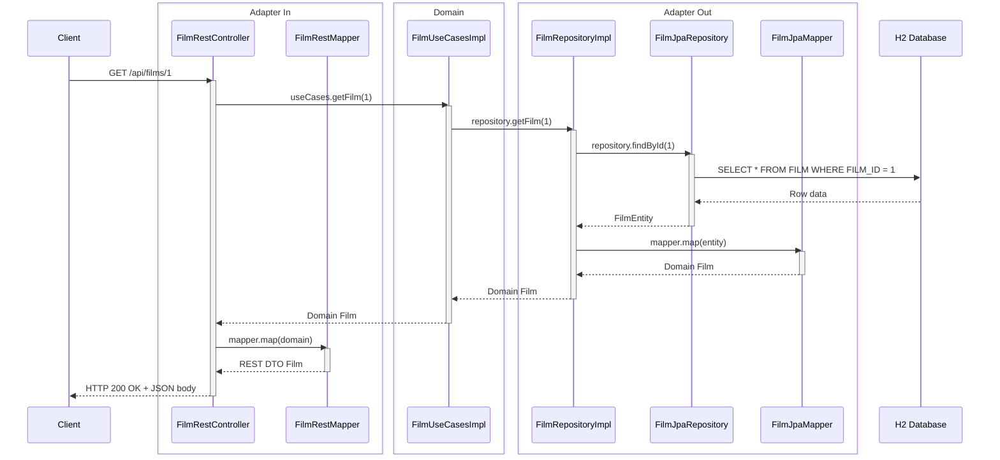
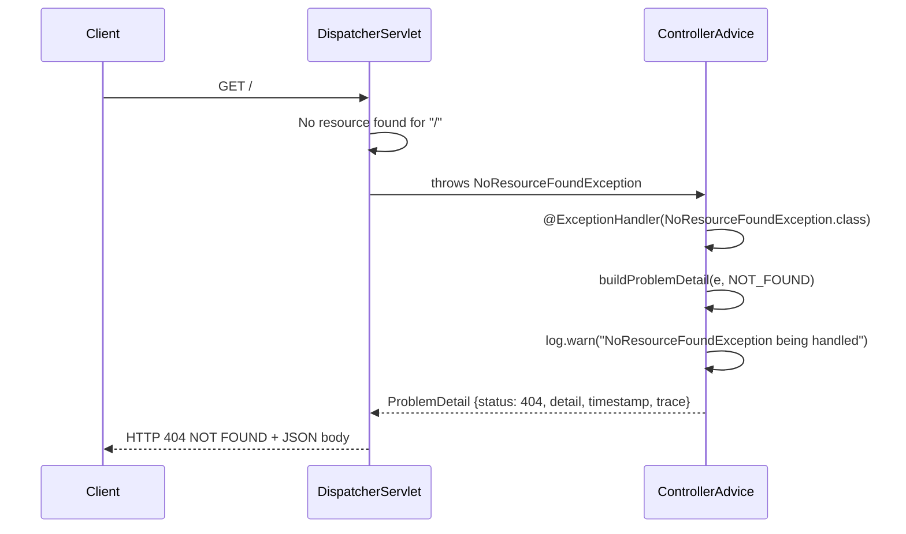

# Spring Boot Demo Projects Monorepo

This repository implements some use cases from the [Sakila Sample Database](https://dev.mysql.com/doc/sakila/en/) in Java/Kotlin/Groovy Spring Boot. It serves as a demo project for [Pollito's Opinion on Spring Boot Development](https://springboot.pollito.tech/), a Spring Boot guide.

<!-- TOC -->
* [Spring Boot Demo Projects Monorepo](#spring-boot-demo-projects-monorepo)
  * [Essential Commands](#essential-commands)
    * [Build Commands](#build-commands)
    * [Run Tests](#run-tests)
    * [Code Formatting](#code-formatting)
  * [Local Development](#local-development)
  * [Stack](#stack)
    * [Primary Languages](#primary-languages)
    * [Runtime](#runtime)
    * [Frameworks](#frameworks)
    * [Key Dependencies](#key-dependencies)
  * [Architecture](#architecture)
  * [Codebase Structure](#codebase-structure)
  * [REST Request Flow Examples](#rest-request-flow-examples)
    * [Success Example](#success-example)
    * [Error Example](#error-example)
  * [Cross-Cutting Concerns](#cross-cutting-concerns)
    * [Error Handling](#error-handling)
    * [Logging](#logging)
    * [Mapping](#mapping)
  * [Integrations](#integrations)
    * [APIs & External Services](#apis--external-services)
    * [Data Storage](#data-storage)
    * [Authentication & Identity](#authentication--identity)
    * [Monitoring & Observability](#monitoring--observability)
    * [CI/CD & Deployment](#cicd--deployment)
    * [Webhooks & Callbacks](#webhooks--callbacks)
  * [Testing](#testing)
    * [What to Test](#what-to-test)
    * [SQL Test Data](#sql-test-data)
  * [Contribution](#contribution)
<!-- TOC -->

## Essential Commands

### Build Commands

- `./gradlew build` - Full build: formats code, compiles, tests, runs coverage & mutation testing
- `./gradlew :spring_java:build` - Build only Java module
- `./gradlew :spring_groovy:build` - Build only Groovy module
- `./gradlew :spring_kotlin:build` - Build only Kotlin module

### Run Tests

- `./gradlew test` - Run all tests across all modules
- `./gradlew :{module}:test` - Run tests for specific module
- `./gradlew :spring_java:test --tests dev.pollito.spring_java.sakila.film.adapter.in.rest.FilmRestControllerMockMvcTest` - Run single test (Java example)

### Code Formatting

- `./gradlew spotlessCheck` - Check code formatting
- `./gradlew spotlessApply` - Apply code formatting (Formatting is applied automatically during `./gradlew build`)

## Local Development

For the best local development experience, I recommend running the projects with their respective `bootRun` commands and using the `dev` profile to avoid OTLP connection noise:

```bash
# Run with dev profile
./gradlew :spring_java:bootRun -Dspring.profiles.active=dev
./gradlew :spring_kotlin:bootRun -Dspring.profiles.active=dev  
./gradlew :spring_groovy:bootRun -Dspring.profiles.active=dev
```

## Stack

### Primary Languages

- Java 21 - Used in `spring_java` module
- Kotlin 2.2.21 - Used in `spring_kotlin` module
- Groovy 5.x - Used in `spring_groovy` module

### Runtime

- **Environment:** Java 21 (via Gradle toolchain)
- **Build Tool:**
    - Gradle 9.2.1
    - Wrapper: `gradle/wrapper/gradle-wrapper.properties`
- **Package Manager:** Maven Central (repositories)

### Frameworks

- **Core:** Spring Boot 4.0.x - All modules
- **Code Generation:**
    - OpenAPI Generator 7.x.x - API code generation
    - Hibernate Tools 7.x.x - Entity reverse engineering from SQL schema
- **Code Quality:** Spotless - Code formatting
    - Google Java Format (Java)
    - Ktfmt (Kotlin)
    - GREclipse (Groovy)
- **Code coverage**: JaCoCo 0.8.14 - (80% line coverage required)

### Key Dependencies

- **Mapping:**
    - MapStruct 1.7.x - Java/Kotlin DTO mapping
    - ModelMapper 3.2.6 - Groovy DTO mapping
- **Database:**
    - Spring Boot Starter Data JPA
    - Hibernate ORM 7.x.x - JPA implementation
    - H2 2.4.240 - In-memory database (dev/test)
    - PostgreSQL - Production database
    - Flyway - Database migrations (via docker-compose)
- **API & Documentation:**
    - Swagger Annotations 2.2.x - OpenAPI
    - Jackson Databind Nullable 0.2.9 - Optional JSON fields
    - Spring Boot Starter Validation - Request validation
    - SpringDoc OpenAPI Starter WebMVC UI - Needed by the `x-spring-paginated` OpenAPI generator vendor extension
- **Logging & Observability:**
    - Spring Boot Starter AspectJ - AOP support
    - Spring Boot Starter OpenTelemetry - Distributed tracing
    - Micrometer Prometheus 1.17.0-M2 - Metrics export
    - Kotlin Logging JVM 8.x.x - Kotlin logging facade (Kotlin module)

## Architecture

The modules in this repository are built around **Hexagonal Architecture** (also known as Ports and Adapters). The primary goal is to isolate the core business logic (Domain) from technical delivery mechanisms (REST APIs) and infrastructure (Databases).

However, to keep the codebase practical and avoid over-engineering, this project takes a pragmatic, opinionated approach. It **does not** follow Hexagonal Architecture to the absolute strictest, textbook detail.

Notable deviations include:

1. **Framework Coupling in the Domain (Spring DI):** In a pure Hexagonal Architecture, the domain layer should have absolutely zero dependencies on external frameworks. In this codebase, domain implementations (e.g., `{Entity}UseCasesImpl`) are annotated with Spring's `@Service`. We rely on Spring Boot's Dependency Injection rather than wiring pure Java/Kotlin/Groovy objects manually in external configuration classes. This introduces a slight framework coupling in exchange for significant developer convenience and boilerplate reduction.
2. **Relaxed Interface Segregation Principle (ISP):** Strict adherence to ISP in Hexagonal Architecture often leads to highly granular, single-method use cases (e.g., `FindFilmUseCase`, `CreateFilmUseCase`, `UpdateFilmUseCase`). Instead, this project groups related operations into cohesive inbound and outbound ports (e.g., a single `{Entity}UseCases` interface and a single `{Entity}Repository` interface). While this relaxes strict ISP, it heavily reduces file clutter and cognitive load, which is preferable for standard CRUD-heavy and moderate-complexity domains.
3. **Shared Domain Model for Read and Write Operations:** In a strict Hexagonal Architecture, read and write operations often use separate models (e.g., a dedicated `FilmFields` domain object for Create/Update, distinct from the `Film` entity). This project reuses the same domain class (`Film`) for both read and write paths, making nullable fields like `id` and `lastUpdate` acceptable during creation. This reduces boilerplate and mapping complexity at the cost of a less semantically precise domain model.
4. **`Page` Abstraction Leaking Across Layers:** In a pure Hexagonal Architecture, pagination should be abstracted behind a domain-specific type to avoid coupling the domain layer to framework-specific classes. This project uses `org.springframework.data.domain.Page` directly in the domain layer ports and services, letting it propagate from the JPA adapter all the way up to the REST controllers. Re-implementing a custom `Page` wrapper for each layer would add significant boilerplate with no meaningful gain for standard CRUD operations.

## Codebase Structure

Some important files and directories are:

```
springboot-demo-projects/
├── database/              # Database configuration (Postgres + Flyway setup)
├── observability/         # Observability configuration (OpenTelemetry, Prometheus, Loki, Tempo, and Grafana)
├── spring_java/           # Java 21 module
├── spring_kotlin/         # Kotlin 2.x module
├── spring_groovy/         # Groovy 5.x module
├── AGENTS.md              # Information for coding agents
├── docker-compose.yml     # Orchestration for Docker deployment
└── README.md              # This document
```

Each module (`spring_{java|kotlin|groovy}`) follow similar directory layout. Some important files and directories are:

```
{module}/
├── build/  # NOT VERSION CONTROLLED
│   ├── generated/sources/
│   │   ├── openapi/        # API interfaces & model classes. Generated from `src/main/resources/openapi.yaml` via OpenAPI Generator
│   │   └── hibernate/      # JPA entity classes mapped from database tables. Generated from `src/main/resources/sakila-schema.sql` via Hibernate Tools
│   └── reports/jacoco/test # JaCoCo test reports
├── src/
│   ├── main/
│   │   ├── {java|kotlin|groovy}/dev/pollito/{module}/
│   │   │   ├── config/
│   │   │   │   ├── enums/
│   │   │   │   │   ├── EnumUtils.{java|kt|groovy}              # Generic interface that enums can implement to expose a custom value of type T through the getValue() method
│   │   │   │   │   └── ValuedEnum.{java|kt|groovy}             # Utility class that provides a static fromValue method to find an enum constant by its associated ValuedEnum value
│   │   │   │   ├── log/
│   │   │   │   │   ├── LogAspect.{java|kt|groovy}              # Spring AOP aspect, logs the arguments and return values
│   │   │   │   │   ├── LogFilter.{java|kt|groovy}              # Spring OncePerRequestFilter, logs incoming HTTP request details and the outgoing response status
│   │   │   │   │   ├── MaskingPatternLayout.{java|kt|groovy}   # Logback PatternLayout, intercepts log output and redacts sensitive data
│   │   │   │   │   └── OTelApiTraceSpanFilter.{java|kt|groovy} # Spring OncePerRequestFilter, assigns Trace ID
│   │   │   │   └── web/ControllerAdvice.{java|kt|groovy}       # RestControllerAdvice class, globally handles common exceptions
│   │   │   ├── {domain}/
│   │   │   │   └── {entity}/
│   │   │   │       ├── adapter/
│   │   │   │       │   ├── in/rest/
│   │   │   │       │   │   ├── {Entity}RestController.{java|kt|groovy}   # REST controller, exposes endpoints
│   │   │   │       │   │   └── {Entity}RestMapper.{java|kt|groovy}       # Maps between domain models and generated REST API DTO
│   │   │   │       │   └── out/jpa
│   │   │   │       │       ├── {Entity}JpaMapper.{java|kt|groovy}        # Maps between domain models and generated JPA entities
│   │   │   │       │       ├── {Entity}JpaRepository.{java|kt|groovy}    # Spring Data JPA repository interface, provides database operations
│   │   │   │       │       └── {Entity}RepositoryImpl.{java|kt|groovy}   # Outbound adapter, implements the domain's {Entity}Repository port
│   │   │   │       └── domain/
│   │   │   │           ├── model/                                        # Domain models like {Entity}.{java|kt|groovy} and enums
│   │   │   │           ├── port/
│   │   │   │           │   ├── in/{Entity}UseCases.{java|kt|groovy}      # Inbound port, defines the interface through which external actors interact with the domain layer
│   │   │   │           │   └── out/{Entity}Repository.{java|kt|groovy}   # Outbound port, defines the interface for retrieving a collection of objects that belongs to a database
│   │   │   │           └── service/{Entity}UseCasesImpl.{java|kt|groovy} # Inbound port implementation, core of the hexagonal architecture, exposes domain capabilities and orchestrates by delegating to outbound ports
│   │   │   └── Spring{Java|Kotlin|Groovy}Application.{java|kt|groovy}    # Spring Application main class
│   │   └── resources/
│   │       ├── application-dev.yaml                # Development profile config
│   │       ├── application.yaml                    # Main Spring Boot config meant for production environment
│   │       ├── hibernate.reveng.xml                # Hibernate reverse-engineering config
│   │       ├── hibernate-tools.properties          # Hibernate Tools settings
│   │       ├── logback-spring.xml                  # Logback logging config
│   │       ├── openapi.yaml                        # OpenAPI spec, input for generating API interfaces & DTOs
│   │       ├── sakila-data.sql                     # Sample data, used by in-memory database when development profile is active
│   │       ├── sakila-schema.sql                   # DB schema, used for in-memory database when development profile is active, and as input for generating JPA entities via Hibernate Tools
│   │       └── templates/hibernate/pojo/Pojo.ftl   # FreeMarker template, customizes generated JPA entities
│   └── test/
│       ├── {java|kotlin|groovy}/dev/pollito/{module}/  # Mirrors main package structure as needed
│       └── resources/
│           ├── application-test.yaml   # Test profile config
│           ├── sakila-data.sql         # Sample data for tests
│           └── sakila-schema.sql       # DB schema for tests
├── Dockerfile      # Multi-stage build (build + runtime)
└── build.gradle    # (Or build.gradle.kts if Kotlin) Plugins, configurations & dependencies
```

## REST Request Flow Examples

Stateless REST pattern - each request is independent

### Success Example

```log
$ curl -s http://localhost:8080/api/films/1 | jq
{
  "instance": "/api/films/1",
  "status": 200,
  "timestamp": "2026-03-08T01:49:43.360796324Z",
  "trace": "b7639cc6048c55bd18954a6f61c1c818",
  "data": {
    "id": 1,
    "title": "ACADEMY DINOSAUR",
    ...
   }
 }
```



### Error Example

```
curl -s http://localhost:8080 | jq; curl -sw "→ HTTP %{http_code}\n" -o /dev/null http://localhost:8080
{
  "detail": "No static resource  for request '/'.",
  "instance": "/",
  "status": 404,
  "title": "Not Found",
  "timestamp": "2026-01-11T20:16:13.240960834Z",
  "trace": "d9178227-18d6-4442-8598-9a9f17f65f9c"
}
→ HTTP 404
```



## Cross-Cutting Concerns

### Error Handling

- `@RestControllerAdvice` class catches all exceptions
  - Exception types mapped to HTTP status codes
  - Error responses include: `title`, `detail`, `status`, `instance`, `timestamp`, `trace` (OpenTelemetry)

### Logging

- `LogAspect` - Spring AOP aspect, logs the arguments and return values
- `LogFilter` - Spring `OncePerRequestFilter`, logs incoming HTTP request details and the outgoing response status
- `MaskingPatternLayout` - Logback `PatternLayout`, intercepts log output and redacts sensitive data
- `OTelApiTraceSpanFilter` - Spring `OncePerRequestFilter`, assigns Trace ID

### Mapping

- MapStruct for Java/Kotlin
- ModelMapper for Groovy

## Integrations

### APIs & External Services

None yet

### Data Storage

| Database       | Purpose             | Connection                      |
|----------------|---------------------|---------------------------------|
| PostgreSQL     | Production          | `SPRING_DATASOURCE_URL` env var |
| H2 (in-memory) | Development/Testing | Auto-configured                 |

- ORM: Hibernate 7.0.2.Final
- Dialect: `PostgreSQLDialect`
- Migration: Flyway (disabled in app, runs via docker-compose)
- JDBC Drivers:
    - PostgreSQL: `org.postgresql:postgresql`
    - H2: `com.h2database:h2`

### Authentication & Identity

None yet

### Monitoring & Observability

- **Metrics:** Micrometer with Prometheus registry
    - Exposed endpoints: health, info, prometheus, metrics
    - Metrics Collection: Prometheus
- **Tracing:** OpenTelemetry with Grafana Tempo
- **Logs:** Logback via Spring Boot
    - All modules must use this standardized format with trace context:
      ```
      %d{yyyy-MM-dd} %d{HH:mm:ss.SSS} trace_id=%X{trace_id} span_id=%X{span_id} trace_flags=%X{trace_flags} %-5level %thread --- %logger{36} %msg%n
      ```
    - Forwarded to Loki via Promtail
- **Visualization:** Grafana Dashboards
    - Data sources: Prometheus (metrics), Loki (logs), Tempo (traces)

### CI/CD & Deployment

This project is prepared to be deployed as a Docker Compose application

**Services (`docker-compose.yml`):**

| Service       | Port | Purpose                 |
|---------------|------|-------------------------|
| postgres      | 5432 | Database                |
| pgadmin       | 5050 | Database administration |
| flyway        | -    | Database migrations     |
| spring-java   | 8081 | Java module             |
| spring-kotlin | 8082 | Kotlin module           |
| spring-groovy | 8083 | Groovy module           |
| prometheus    | 9090 | Metrics collection      |
| loki          | 3100 | Log aggregation         |
| promtail      | 9080 | Log shipping            |
| tempo         | 3200 | Distributed tracing     |
| grafana       | 3000 | Visualization           |

**Network:** Docker bridge network: `monitoring`

**Environment variables**: (these are passed to running containers through the `environment:` block in docker-compose)

- `POSTGRES_DB` — Name of the default database
- `POSTGRES_USER` — PostgreSQL superuser username
- `POSTGRES_PASSWORD` — PostgreSQL superuser password
- `SAKILA_APP_PASSWORD` — Password for the `sakila_app` application user (used by Spring services)
- `PGADMIN_DEFAULT_EMAIL` — Admin login email for pgAdmin web interface
- `PGADMIN_DEFAULT_PASSWORD` — Admin password for pgAdmin web interface
- `GF_SECURITY_ADMIN_USER` — Grafana admin username
- `GF_SECURITY_ADMIN_PASSWORD` — Grafana admin password

**Deployment Flow:**

1. Push to `main` → GitHub Actions triggered (`.github/workflows/ci-cd.yml`)
    1. `build-and-test` job compiles and runs tests
    2. `deploy` job calls Coolify webhook **only if CI passes**
2. Coolify builds Docker containers and deploys

### Webhooks & Callbacks

None yet

## Testing

### What to Test

**Test**
- **Adapter In (REST):** Group and test REST adapter classes together under a `@WebMvcTest` web layer slice test.
- **Adapter Out (JPA):** Group and test JPA adapter classes together under a `@DataJpaTest` JPA layer slice test.
- **Domain Use Cases:** Test implementation classes as plain unit tests.
- **Configuration:** `@RestControllerAdvice` classes are tested with a `MockMvc` standalone `@WebMvcTest` web layer slice test.

**Skip**
- Log-related filters and aspects in `config.log` — too much trouble for too little win
- OpenAPI generated code: `**/generated/**`, `**/openapitools/**`
- Application entry points: `**/*Application*`
- Domain models (POJOs): `**/domain/model/**`
- Groovy ModelMapper:`**/config/mapper/**` 
- Groovy internals: `**/*$*_closure*`, `**/*__*$*`

| Category               | Java                                             | Kotlin                                                       | Groovy                                           |
|------------------------|--------------------------------------------------|--------------------------------------------------------------|--------------------------------------------------|
| **Runner**             | JUnit 5 (Jupiter)                                | JUnit 5 via Kotlin Test                                      | Spock 2.4                                        |
| *Package/Dependency*   | `org.junit.jupiter.api`                          | `kotlin-test-junit5`                                         | `org.spockframework:spock-core:2.4-groovy-5.0`   |
| *Configuration*        | `spring-boot-starter-test`, `useJUnitPlatform()` | `useJUnitPlatform()` in build.gradle.kts                     | `org.spockframework:spock-spring:2.4-groovy-5.0` |
| *Base Class/Extension* | —                                                | —                                                            | `spock.lang.Specification`                       |
| **Mocking**            | Mockito                                          | MockK                                                        | Spock Mocks                                      |
| *Package/Dependency*   | `org.mockito`                                    | `io.mockk:mockk:1.14.7`, `com.ninja-squad:springmockk:5.0.1` | Built-in: `Mock()`, `Stub()`, `GroovyMock()`     |
| *Extension*            | `@ExtendWith(MockitoExtension.class)`            | `@ExtendWith(MockKExtension::class)`                         | —                                                |
| *Spring MockBean*      | `@MockitoBean` (3.4+), `@MockBean` (older)       | `@MockkBean`                                                 | `@SpringBean`                                    |
| **Assertion**          | JUnit 5 assertions                               | Kotlin Test                                                  | Spock matchers                                   |
| *Package/Style*        | `org.junit.jupiter.api.Assertions`               | `kotlin.test.Test`, `kotlin.test.assertNotNull`              | Inline in `expect:` and `then:` blocks           |
| *MockMvc*              | `MockMvcResultMatchers`                          | MockMvc DSL                                                  | `org.springframework.test.web.servlet.result.*`  |
| **Naming**             |                                                  |                                                              |                                                  |
| *Plain unit tests*     | `{ClassName}Test.java`                           | `{ClassName}Test.kt`                                         | `{ClassName}Spec.groovy`                         |
| *Tests using MockMvc*  | `{ClassName}MockMvcTest.java`                    | `{ClassName}MockMvcTest.kt`                                  | `{ClassName}MockMvcSpec.groovy`                  |
| *Tests annotated with @DataJpaTest* | `{ClassName}DataJpaTest.java`         | `{ClassName}DataJpaTest.kt`                                  | `{ClassName}DataJpaSpec.groovy`                  |
| **Coverage Minimums**  |                                                  |                                                              |                                                  |
| *LINE*                 | 80%                                              | 80%                                                          | 80%                                              |
| *BRANCH*               | 50%                                              | 50%                                                          | —                                                |

### SQL Test Data

- Located in: `src/test/resources/`
- Schema: `sakila-schema.sql`
- Data: `sakila-data.sql`
- Loaded by `@DataJpaTest` tests via `@Sql(scripts = {"/sakila-schema.sql", "/sakila-data.sql"}, executionPhase = BEFORE_TEST_CLASS)`

## Contribution

This project is intended as a companion to the [Pollito's Opinion on Spring Boot Development](https://springboot.pollito.tech/) guide. While direct contributions to this demo repository are not actively sought, feedback on the guide itself is always welcome.